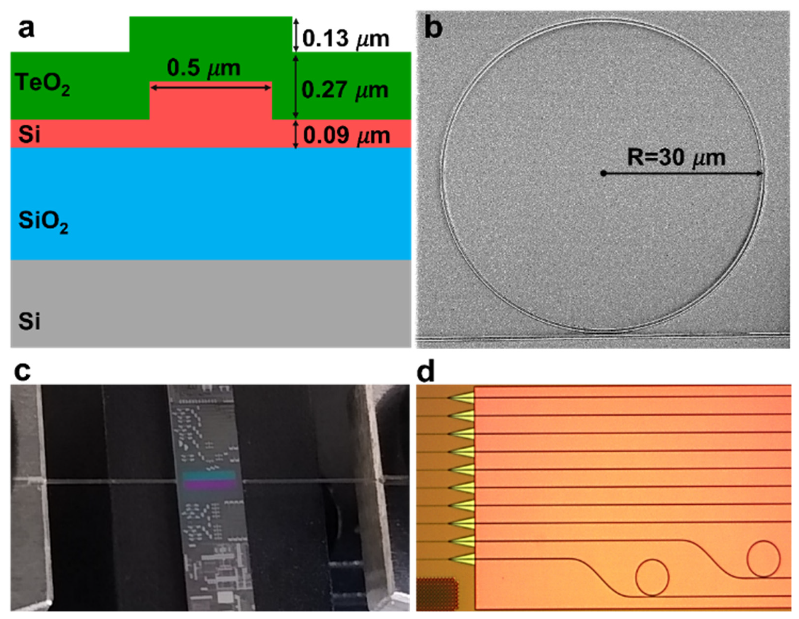

# Predicting Microring Resonance from Inline Metrology

## Contents

- [Overview](#overview)
- [Core Idea](#core-idea)
- [Plain-Language Glossary](#plain-language-glossary)
- [Data Story](#data-story)
- [Synthetic Process Engine](#synthetic-process-engine)
- [Where the Physical Model Comes From](#where-the-physical-model-comes-from)
- [Pass/Fail Rule](#passfail-rule)
- [Project Structure](#project-structure)
- [Notebook Guide](#notebook-guide)
- [How To Run](#how-to-run)
- [What To Expect](#what-to-expect)
- [Current Limits](#current-limits)

## Overview

This project is a small synthetic data exploration story about silicon photonics manufacturing. The central question is explored is:

> **Can cheaper inline measurements help explain and predict downstream optical test results?**

The dataset is synthetic. It is not real fab data and it is not a full physics simulator. Instead, it is designed to be understandable, inspectable, and realistic enough for exploratory data analysis.

The project connects three ideas:

1. **A simplified physical model**  
   Small fabrication variations in microring geometry shift the resonance wavelength.

2. **A synthetic manufacturing dataset**  
   Every die has inline metrology data, but only some dies have downstream optical test results.

3. **A simple predictive baseline**  
   Linear Regression is used to test whether inline measurements contain enough signal to predict downstream resonance wavelength.

The main goal is clarity, not model complexity. Here is a plain-language summary before we proceed:

## Plain-Language Glossary

| Term | Meaning |
| --- | --- |
| Wafer | A circular silicon slice containing many repeated chip sites |
| Die | One chip location on the wafer |
| Lot | A group of wafers that share common process fingerprint |
| Inline metrology | Early process measurements, available for every die |
| Downstream test | Later optical test data, available only for some dies |
| Microring resonator | A small ring-shaped optical device with a resonance wavelength |
| `lambda_res_nm` | Measured resonance wavelength in nanometers; this is the main ML target |
| `q_loaded` | Loaded quality factor; higher usually means less optical loss |
| `test_pass` | Downstream pass/fail flag: `1` means pass, `0` means fail |
| Not tested | A die with an inline row but no downstream row |

## Core Idea

Silicon photonics microring resonators are small ring-shaped optical devices built on a silicon photonics platform.

A microring resonator works by guiding light around a closed-loop waveguide. At specific wavelengths, the optical field constructively interferes after one round trip around the ring. Those wavelengths are called *resonance wavelengths*.

Microring resonators are useful because they can act as compact wavelength-selective components. In practice, they are used for tasks such as:

- filtering or selecting specific optical wavelengths
- wavelength-division multiplexing and demultiplexing
- optical modulation
- sensing applications, where small environmental changes shift the resonance
- compact photonic integrated circuits for communication and computing systems

However, this compactness comes with a manufacturing challenge.

Silicon photonics microring resonators are sensitive to small fabrication variations. If the waveguide is slightly wider, narrower, thicker, or thinner than intended, the effective refractive index of the guided optical mode changes. That change can shift the optical resonance wavelength.

This is why inline metrology can be useful: if early process measurements contain information about geometry variation, they may also contain signal about downstream optical behavior.

<p align="center">
  
</p>

In a real manufacturing flow, inline metrology is usually cheaper and more available than downstream optical testing. This motivates a virtual metrology question:

> **Can early process measurements help predict later optical behavior?**

This project simulates that situation.

The generator first creates a hidden synthetic physical state for each die. From that hidden state, it creates two public data sources:

- an inline metrology table
- a downstream optical test table

The notebooks then inspect the data, visualize wafer-level spatial patterns, and train one simple baseline model.

The full story is:

```text
synthetic process variation
        ↓
hidden true geometry and quality state
        ↓
noisy inline metrology + partial downstream optical test
        ↓
EDA and wafer maps
        ↓
simple Linear Regression baseline
```


## Data Story

The generator creates two public CSV files.

### 1. Inline metrology

`data/synthetic_inline_metrology.csv`

This table has one row per die. It represents earlier and cheaper measurements collected during or near fabrication.

Example columns include measured waveguide width, silicon thickness, etch depth, roughness proxy, overlay, and defect-density proxy.

### 2. Downstream optical test

`data/synthetic_downstream_wafer_test.csv`

This table has one row per die that was tested downstream. Every downstream row represents a usable optical test result.

The three public downstream states are:

- `Pass`: the die appears in the downstream table and `test_pass = 1`
- `Fail`: the die appears in the downstream table and `test_pass = 0`
- `Not tested`: the die appears in inline metrology but has no downstream row

There is intentionally no separate `test_valid` column.

A downstream row already means:

> this die has a valid downstream test record.

A missing downstream row means:

> this die was not tested downstream.

## Synthetic Process Engine

The synthetic generator is configured through `SyntheticMRRProcessConfig` in `src/physics.py` and implemented by `SyntheticMRRDataGenerator` in `src/generator.py`.

The generator is not a foundry-calibrated simulator. It is a small process engine designed to create a coherent synthetic manufacturing dataset.

It builds the hidden physical state in layers:

```text
lot-level variation
        ↓
wafer-level variation
        ↓
within-wafer spatial variation
        ↓
die-level random variation
        ↓
measurement noise
```

### Lot-level variation

A lot is a group of wafers processed under a similar synthetic manufacturing context.

The generator assigns each wafer to one of five lot labels: `L01` to `L05`. Wafers from the same lot share a small latent process fingerprint before wafer-level and die-level variation are added.

The lot effect is intentionally weak. It is meant to create mild lot-to-lot tendencies, not to dominate the wafer maps or the ML task.

In real manufacturing, a lot-level effect could correspond to factors such as:

- starting material differences
- shared tool or chamber condition
- recipe drift
- batch-level contamination or defectivity
- slow process drift over time

In this project, the lot effect is synthetic and latent. It is not written into the public inline table as a perfect “truth” column.

### Wafer-level variation

Each wafer receives its own geometry and quality offsets.

This creates wafer-to-wafer differences such as slightly wider or narrower waveguides, shifted silicon thickness, or different roughness and defectivity baselines.

The wafer-level effect is useful because real manufacturing data rarely consists of fully independent dies. Devices from the same wafer often share systematic process context.

### Within-wafer spatial variation

Within a wafer, the generator adds smooth spatial fields:

- a radial component
- an angular component
- a low-frequency random component

These fields make nearby dies more similar than distant dies. This prevents the dataset from looking like independent random noise.

### Edge effect

The generator includes an edge-related degradation effect.

The edge effect increases near the wafer perimeter and mainly affects roughness and defectivity. Since roughness and defects reduce optical quality, this tends to lower `q_loaded` and increase the probability of downstream failure near the wafer edge.

The intended result is not a deterministic rule where every edge die fails. Instead, edge regions should show a higher risk of degraded quality while still preserving randomness and mixed outcomes.

### Semi-ring local effect

The generator also includes a localized semi-ring effect.

This creates a partial radial/angular pattern on the wafer rather than a perfectly symmetric center-to-edge gradient. It is included to make wafer maps more realistic and visually inspectable.

### Die-level and measurement noise

Finally, each die receives local random variation and measurement noise.

The hidden true geometry and quality values are not exposed to the public modeling workflow. The public inline table contains noisy measurements, such as:

$$
w_{i,\mathrm{meas}} = w_i + \epsilon_{i,\mathrm{width}}
$$

$$
t_{i,\mathrm{meas}} = t_i + \epsilon_{i,\mathrm{thickness}}
$$

This is important because a real model would not have access to perfect hidden truth. It would only see noisy measurements.

### Downstream sampling and missingness

Downstream optical testing is partial.

The generator first selects a subset of dies for planned downstream testing. Then it applies quality-dependent missingness: devices with very low Q are more likely to be missing from the final usable downstream table.

This creates two missingness ideas:

- planned partial sampling
- quality-dependent missingness

The final downstream table contains only usable optical test rows.

## Where the Physical Model Comes From

Microring resonators have a resonance condition: light resonates when the optical round trip around the ring matches an integer number of wavelengths.

A simplified resonance condition can be written as:

$$
m \lambda_{\mathrm{res}} = n_{\mathrm{eff}} L
$$

where:

- $m$ is the resonance order
- $\lambda_{\mathrm{res}}$ is the resonance wavelength
- $n_{\mathrm{eff}}$ is the effective refractive index of the guided optical mode
- $L$ is the physical round-trip length of the microring

The important idea is that $n_{\mathrm{eff}}$ is not just a material constant. It depends on the waveguide geometry.

Small fabrication changes can alter the effective index:

- a wider waveguide changes optical confinement
- a thicker silicon layer changes optical confinement
- those changes shift the resonance wavelength

The real electromagnetic relationship is complex and generally requires simulation. However, near a nominal design point, it can be approximated with a first-order Taylor-style sensitivity model.

The loaded quality factor is modeled with a log-linear degradation rule:

<p align="center">
  <strong>log(Q<sub>i</sub>) = log(Q<sub>0</sub>) − k<sub>r</sub> r<sub>i</sub> − k<sub>d</sub> d<sub>i</sub> + η<sub>i</sub><sup>(Q)</sup></strong>
</p>

where:

- $\lambda_i$ is the resonance wavelength for die $i$
- $\lambda_0$ is the nominal resonance wavelength
- $t_i$ is the true silicon thickness for die $i$
- $w_i$ is the true waveguide width for die $i$
- $t_0$ is the nominal silicon thickness
- $w_0$ is the nominal waveguide width
- $\alpha$ is the sensitivity to thickness variation
- $\beta$ is the sensitivity to width variation
- $\eta_i^{(\lambda)}$ is a residual noise term

This is best understood as a local approximation.

It does not claim to be a full optical simulator. It only says that, for small deviations around a nominal geometry, resonance shift can be approximated as a weighted sum of geometry deviations.

The sensitivity coefficients are literature-inspired fixed parameters used for a synthetic benchmark. They are plausible for silicon photonics, but they are not calibrated to a specific confidential foundry process.

### Quality-factor model

The Q-factor model is also intentionally simple.

The loaded quality factor is modeled with a log-linear degradation rule:

$$\log Q_i = \log Q_0 - k_r r_i - k_d d_i + \eta_i^{(Q)}$$

where:

- $Q_i$ is the loaded quality factor for die $i$
- $Q_0$ is the nominal quality factor
- $r_i$ is a roughness-related degradation term
- $d_i$ is a defect-density-related degradation term
- $k_r$ controls the roughness penalty
- $k_d$ controls the defect-density penalty
- $\eta_i^{(Q)}$ is a residual noise term

This captures one useful direction:

> rougher sidewalls and more defects increase optical loss, and more optical loss lowers Q.

The project uses `q_loaded` both as a measured downstream quantity and as part of the pass/fail rule.

## Pass/Fail Rule

A tested die passes the downstream specification only if both conditions are true:

$$
\lambda_{\mathrm{spec,min}}
\le
\lambda_{\mathrm{res,nm}}
\le
\lambda_{\mathrm{spec,max}}
$$

and

$$
q_{\mathrm{loaded}} \ge q_{\mathrm{spec,min}}
$$

Otherwise, the tested die fails.

A die with no downstream row is not counted as pass or fail. It is simply not tested.

## Project Structure

```text
pyproject.toml          project metadata and dependencies
README.md               project guide

data/
  synthetic_inline_metrology.csv
  synthetic_downstream_wafer_test.csv

src/
  physics.py            process configuration and physics-inspired equations
  generator.py          synthetic lot, wafer, die, and downstream test generation
  utils.py              CSV I/O, schema checks, merge helpers, and plots

tests/
  test_generator.py     generator, schema, spatial effect, and utility tests

notebooks/
  01_data_eda.ipynb        data generation, physical model explanation, and EDA
  02_wafermap_story.ipynb  wafer-map story for pass/fail/not-tested status
  03_baseline_model.ipynb  minimal Linear Regression baseline
```

## Notebook Guide

The notebooks are meant to be read in order.

```text
01_data_eda.ipynb
        ↓
02_wafermap_story.ipynb
        ↓
03_baseline_model.ipynb
```

### `01_data_eda.ipynb`

Start here.

This notebook explains the data, generates the CSV files, validates the schemas, and performs basic EDA.

It answers:

- What is a wafer?
- What is a die?
- What is a lot?
- What is inline metrology?
- What is downstream optical testing?
- Where do the resonance and Q formulas come from?
- How many dies are pass, fail, and not tested?
- Do inline width and thickness measurements relate to `lambda_res_nm`?
- Does downstream status vary with wafer radius?

### `02_wafermap_story.ipynb`

This notebook is the spatial EDA artifact.

It answers:

- Where on each wafer do we have tested pass dies?
- Where do tested dies fail?
- Where do we have no downstream test coverage?
- Do failures look clustered near edges or local regions?
- Do continuous downstream measurements show spatial structure?


### `03_baseline_model.ipynb`

This notebook keeps ML small.

It trains one Linear Regression baseline using public inline measurements to predict `lambda_res_nm` for dies with downstream test results.

It uses a wafer holdout split so the test set contains entire wafers, not random rows from the same wafers.

The notebook stops after a simple baseline on purpose. More model experiments would add complexity without supporting the main project goal.

## How To Run

Install the project in editable mode:

```bash
pip install -e .
```

Then open the notebooks in order:

```bash
jupyter notebook notebooks/01_data_eda.ipynb
jupyter notebook notebooks/02_wafermap_story.ipynb
jupyter notebook notebooks/03_baseline_model.ipynb
```

The first notebook regenerates and saves the CSV files. The second and third notebooks load the saved CSV files from `data/`.

## What To Expect

The EDA should show:

- a regular circular die layout
- partial downstream coverage
- a production-like mix of pass and fail among tested dies
- not-tested dies visible after joining downstream back to inline
- mild lot-to-lot variation
- reduced but still present wafer-to-wafer variation
- spatial structure from edge and semi-ring effects
- a clear relationship between inline geometry and resonance wavelength

The wafer maps should show that downstream behavior is spatially inspectable. Edge regions should tend to have worse downstream behavior, but the effect should not be deterministic.

The baseline model should perform reasonably well because the target is intentionally generated from a simple width/thickness relationship.

## Current Limits

This project is intentionally simplified.

It does not use confidential fab data and it is not calibrated to a specific manufacturing process. Instead, it uses synthetic data and physically motivated assumptions to demonstrate the structure of a virtual metrology workflow.

The project does not model:

- real fab calibration
- image-based metrology
- full electromagnetic simulation
- advanced optical device physics
- deep learning
- uncertainty quantification
- production-grade test operations
- post-fabrication thermal tuning control

These limits are intentional.

The goal is not to build a production-ready silicon photonics simulator. The goal is to create a readable synthetic benchmark that connects fabrication variation, inline metrology, downstream optical testing, spatial wafer patterns, and a simple predictive baseline.
